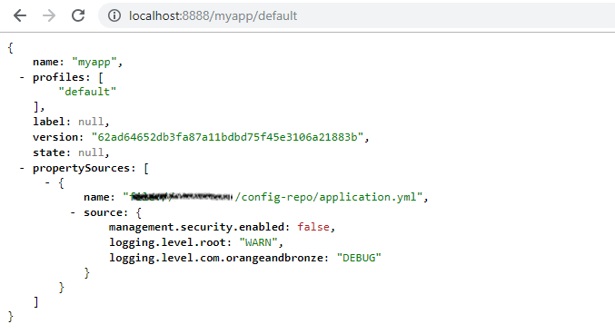
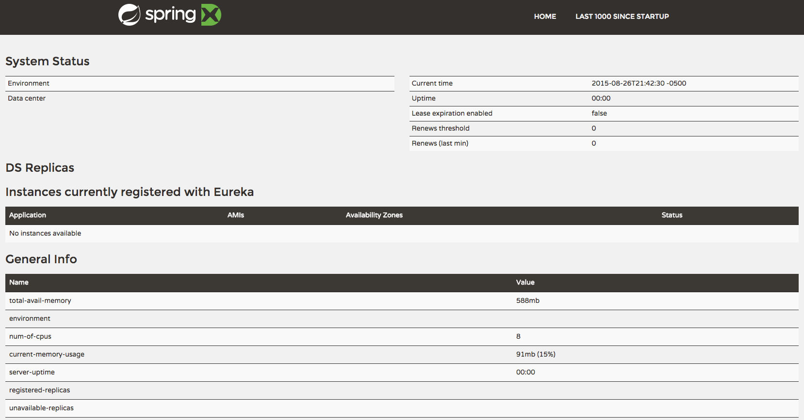

# Spring Cloud Netflix (Eureka): Service Discovery

Estimated Time: 45 minutes

## What You Will Learn

* How to embed Eureka in a Spring Boot application
* How to register services (`greeting-service` and `fortune-service`) with Eureka
* How to discover services (`fortune-service`) with Eureka
* How to use Spring Cloud Services to provision a Service Registry

## Exercises

### Set up the `config-repo` Git repository

1) Create an `$APP_CONFIG_REPO_HOME/application.yml` in your `config-repo` repo with the following contents:

```yml
management:
  security:
	enabled: false

logging:
  level:
	root: WARN
	com:
	  orangeandbronze: DEBUG

```
Then commit and push back to Git.

***A note about the application.yml***

When the `config-server`'s backing repository contains an `application.yml` it is shared with all applications.  Therefore, it is a great place to put common configuration for all applications.  In this case, we have dropped security on all the endpoints and setup logging.

In the Spring Cloud Config lab, we used application specific configuration files:

* One based on the application name `greeting-config.yml`
* One based on the application name + profile `greeting-config-qa.yml`

Application specific files override configuration settings in the `application.yml`.


### Set up `config-server`

1) Start the `config-server` in a terminal window.  You may have a terminal window still open from the previous lab.

```bash
$ cd $SPRING_CLOUD_LABS_HOME/config-server
$ mvn clean spring-boot:run
```

2) Verify the `config-server` is up.  Open a browser and fetch [http://localhost:8888/myapp/default](http://localhost:8888/myapp/default)



Note that a random application name was used and it picked up configuration from the `application.yml`.

### Set up `service-registry`

1) Review the `$SPRING_CLOUD_LABS_HOME/service-registry/pom.xml` file.  By adding `spring-cloud-starter-eureka-server` to the classpath this application is eligible to embed an Eureka server.

```xml
<dependency>
	<groupId>org.springframework.cloud</groupId>
	<artifactId>spring-cloud-starter-eureka-server</artifactId>
</dependency>
```

2) Review the following file: `$SPRING_CLOUD_LABS_HOME/service-registry/src/main/java/com/orangeandbronze/ServiceRegistryApplication.java`.  Note the use of the ` @EnableEurekaServer` annotation that makes this application a Eureka server.

```java
 @SpringBootApplication
 @EnableEurekaServer
 public class ServiceRegistryApplication {

	 public static void main(String[] args) {
		 SpringApplication.run(ServiceRegistryApplication.class, args);
	 }
 }
```

3). Review the following file: `$SPRING_CLOUD_LABS_HOME/service-registry/src/main/resources/application.yml`

```yml
 server:
   port: 8761

 eureka:
   instance:
	 hostname: localhost
   client:
	 registerWithEureka: false
	 fetchRegistry: false
```
***About Eureka***

Eureka is designed for peer awareness (running multiple instances with knowledge of each other) to further increase availability.  Because of this, Eureka is not only a server but a client as well.  Therefore, Eureka Servers will be clients to each other.  `Eureka Server A` &larr;&rarr; `Eureka Server B`.

For the purposes of this lab, we will simplify that configuration to run in standalone mode.  

Stand-alone mode still offers a high degree of resilience with:

* Heartbeats between the client and server to keep registrations up to date
* Client side caching, so that clients don't go to Eureka for every lookup
* By running in Cloud Foundry which is designed to keep applications up by design

With the above configuration, we have configured Eureka to run in standalone mode.

***Understanding the configuration parameters***

* `eureka.instance.hostname` - the hostname for this service. In this case, what host to use to reach our standalone Eureka instance.
* `eureka.client.registerWithEureka` - should this application (our standalone Eureka instance) register with Eureka
* `eureka.client.fetchRegistry` - should this application (our stand alone Eureka instance) fetch the registry (for how to discover services)
* `eureka.client.serviceUrl.defaultZone` - the Eureka instance to use for registering and discovering services.  Notice it is pointing to itself (`localhost`, `8761`).

4) Open a new terminal window.  Start the `service-registry`.

```bash
$ cd $SPRING_CLOUD_LABS_HOME/service-registry
$ mvn clean spring-boot:run
```

5) Verify the `service-registry` is up.  Browse to [http://localhost:8761/](http://localhost:8761/)


### Set up `fortune-service`

1) Review the `$SPRING_CLOUD_LABS_HOME/fortune-service/src/main/resources/bootstrap.yml` file.  The name of this app is `fortune-service`.  It also uses the `config-server`.

```yml
 server:
   port: 8787
 spring:
   application:
	 name: fortune-service
```

`spring.application.name` is the name the application will use when registering with Eureka.

2) Review the `$SPRING_CLOUD_LABS_HOME/fortune-service/pom.xml` file.  By adding `spring-cloud-starter-eureka` to the classpath this application is eligible to register and discover services with the `service-registry`.

```xml
<dependency>
	<groupId>org.springframework.cloud</groupId>
	<artifactId>spring-cloud-starter-eureka</artifactId>
</dependency>
```

3) Review the following file: `$SPRING_CLOUD_LABS_HOME/fortune-service/src/main/java/com/orangeandbronze/FortuneServiceApplication.java`.  Notice the `@EnableDiscoveryClient`.  This enables a discovery client that registers the `fortune-service` with the `service-registry` application.

```java
@SpringBootApplication
@EnableDiscoveryClient
public class FortuneServiceApplication {

	public static void main(String[] args) {
		SpringApplication.run(FortuneServiceApplication.class, args);
	}
}
```

4) Open a new terminal window.  Start the `fortune-service`

```bash
$ cd $SPRING_CLOUD_LABS_HOME/fortune-service
$ mvn clean spring-boot:run
```

5) After a few moments, check the `service-registry` dashboard.  Confirm the `fortune-service` is registered.

The Eureka Dashboard may report a warning, because we aren't setup with multiple peers.  This can safely be ignored.


### Set up `greeting-service`

1) Review the `$SPRING_CLOUD_LABS_HOME/greeting-service/src/main/resources/bootstrap.yml` file.  The name of this app is `greeting-service`.  It also uses the `config-server`.

```yml
 server:
   port: 8080
 spring:
   application:
	 name: greeting-service
```

2) Review the `$SPRING_CLOUD_LABS_HOME/greeting-service/pom.xml` file.  By adding `spring-cloud-starter-eureka` to the classpath this application is eligible to register and discover services with the `service-registry`.

```xml
<dependency>
	<groupId>org.springframework.cloud</groupId>
	<artifactId>spring-cloud-starter-eureka</artifactId>
</dependency>
```

3) Review the following file: `$SPRING_CLOUD_LABS_HOME/greeting-service/src/main/java/com/orangeandbronze/GreetingServiceApplication.java`.  Notice the `@EnableDiscoveryClient`.   This enables a discovery client that registers the `greeting-service` app with the `service-registry`.

 ```java
 @SpringBootApplication
 @EnableDiscoveryClient
 public class GreetingServiceApplication {


	 public static void main(String[] args) {
		 SpringApplication.run(GreetingServiceApplication.class, args);
	 }

 }
```

4) Review the the following file: `$SPRING_CLOUD_LABS_HOME/greeting-service/src/main/java/com/orangeandbronze/greeting/GreetingController.java`.  Notice the `DiscoveryClient`.  `DiscoveryClient` is used to discover services registered with the `service-registry`.  See `fetchFortuneServiceUrl()`.

```java
@Controller
public class GreetingController {

	Logger logger = LoggerFactory
			.getLogger(GreetingController.class);


	@Autowired
	private DiscoveryClient discoveryClient;

	@RequestMapping("/")
	String getGreeting(Model model){

		logger.debug("Adding greeting");
		model.addAttribute("msg", "Greetings!!!");


		RestTemplate restTemplate = new RestTemplate();
		String fortune = restTemplate.getForObject(fetchFortuneServiceUrl(), String.class);

		logger.debug("Adding fortune");
		model.addAttribute("fortune", fortune);

		// resolves to the greeting view
		return "greeting";
	}

	private String fetchFortuneServiceUrl() {
		InstanceInfo instance = discoveryClient.getNextServerFromEureka("FORTUNE-SERVICE", false);
		logger.debug("instanceID: {}", instance.getId());

		String fortuneServiceUrl = instance.getHomePageUrl();
		  logger.debug("fortune service homePageUrl: {}", fortuneServiceUrl);

		return fortuneServiceUrl;
	}

}
```

5) Open a new terminal window.  Start the `greeting-service` app

 ```bash
$ cd $SPRING_CLOUD_LABS_HOME/greeting-service
$ mvn clean spring-boot:run
```

6) After a few moments, check the `service-registry` [dashboard](http://localhost:8761).  Confirm the `greeting-service` app is registered.

7) [Browse](http://localhost:8080/) to the `greeting-service` application.  Confirm you are seeing fortunes.  Refresh as desired.  Also review the terminal output for the `greeting-service`.  See the `fortune-service` `instanceId` and `homePageUrl` being logged.

***What Just Happened?***

The `greeting-service` application was able to discover how to reach the `fortune-service` via the `service-registry` (Eureka).

8) When done stop the `config-server`, `service-registry`, `fortune-service` and `greeting-service` applications.

### `bootstrap.yml` vs `application.yml`

A Spring Cloud application operates by creating a "bootstrap" context, which is a parent context for the main application. Out of the box it is responsible for loading configuration properties from the external sources, and also decrypting properties in the local external configuration files.

Typically, `bootstrap.yml` or `bootstrap.properties` contains two properties:

1. Location of the configuration server (`spring.cloud.config.uri`)
2. Name of the application (`spring.application.name`)

Upon startup, Spring Cloud makes an HTTP call to the config server with the name of the application and retrieves back that application's configuration.
